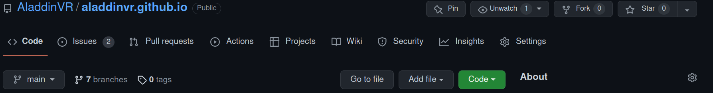
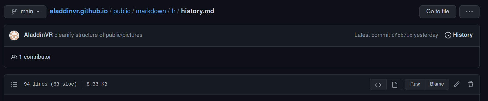

# Bienvenue sur le site du CNC !

Ce ReadME a pour vocation d'expliquer comment fonctionne le site pour que d'autres personnes puissent participer au projet. Il a été mis à jour le 8 mai 2022.

Deux cas de figures se distinguent :

- Vous n'ếtes pas programmeur et vous voulez simplement éditer les articles du site
- Vous voulez modifier la structure du code ou l'enrichir

## Vous voulez mettre à jour un article:

Pour modifier le site directement, sans faire de tests au prélable, assurez-vous que la branche sélectionnée soit `main`.

Vous aurez besoin d'être ajouté au projet en tant qu'éditeur, pour se faire contactez un administrateur du projet et demandez lui de vous rajouter.

Tout se passe dans le dossier `public`:

### Modifier du texte:

Pour modifier les textes, rendez-vous dans le dossier `markdown`. Ce dossier contient, deux sous-dossiers : `en` et `fr`. Ce sont les langues disponibles sur le site. Si vous rajoutez du texte, tachez au maximum de modifier les deux langues en même temps pour éviter les décalages entre les différentes langues.

Note : Sans modifier le code, vous ne pourrez pas rajouter une nouvelle langue.

À l'heure actuelle, il y a 5 onglets sur le site : `Accueil`, `Nous rejoindre`, `Histoire du Club`, `Nos Chansons` et `Record du club`. L'onglet `Record du club` ne possède pas de texte, il contient uniquement les records du clubs (nous y reviendrons plus tard).

Pour changer le texte d'un onglet il suffit de sélectionner le fichier .md dont le nom correspond à l'onglet ! Par exemple si je veux ajouter du texte sur la page d'accueil, je peux aller dans `fr` et choisir le fichier `home.md`.
Le langage utilisé pour les textes s'appelle `le markdown`, c'est un langage qui permet d'écrire en gras, d'ajouter des images, de mettre des titres, etc.
Un tutoriel est disponible [ici](https://github.com/luong-komorebi/Markdown-Tutorial/blob/master/README_fr.md). Ne vous inquiétez pas, ce langage est simple à prendre en main.

Une fois votre fichier sélectionné, cliquez sur le crayon pour passer en mode "modification".

Une fois que vous êtes content de vos modifications, vous pouvez vous rendre tout en bas du fichier pour publier vos changements (`commit` dans le jargon).

Ajouter un nom à votre commit, ce nom doit décrire ce que vous ajoutez (par exemple "mise à jour des tarifs du club"). Une fois le nom défini, sélectionnez `commit directly to the main branch` et appuyez sur `commit changes` pour valider vos changements. **Attention, une fois que vous aurez appuyé sur ce bouton le texte sera mis en production sur le site.** Une fois validé, un déploiement automatique de vos modifications vas s'effectuer (cela dure environ 5 minutes) vous pouvez alors visionner le rendu sur le site du club (il vous faudra peut être aller en navigation privée au début car votre navigateur peut conserver en cache l'ancienne version du site).

### Ajouter une image:

Pour ajouter une image il faudra modifier plusieurs fichiers.

D'abord, rendez-vous dans le dossier `pictures` du dossier `public`. Comme pour la partie texte, sélectionnez le dossier correspondant à l'onglet où se situera votre image (pour l'instant trois onglets possèdent des images: `Histoire du Club`, `Nous rejoindre` et `Accueil`). Si jamais vous voulez créer un nouveau dossier vous
pouvez appuyer sur `Add a file` et `create new file` puis il vous faudra terminer le nom de votre dossier par **/**.

Sinon, dans le cas usuel, rendez vous dans le dossier de l'onglet qui vous intéresse et sélectionnez `Add a file` puis `upload files`, choisissez votre fichier et publiez le (en cliquant sur le bouton `commit` comme pour la partie précedente).

Maintenant qu'une nouvelle image a été ajoutée, il faut l'intégrer au texte de l'onglet ! Pour cela, rendez vous sur le fichier markdown de l'onglet qui vous intéresse (comme pour la partie précédente, attention au langues !). Repérez l'endroit où vous voulez ajouter votre image. Et ajouter ce texte: ``. Cet ligne s'appelle une balise html, et c'est elle qui indique où ajouter l'image, et laquelle on veut. On précise l'origine de l'image avec src="chemin_vers_la_photo" et le texte alternatif avec alt. Vous pouvez vous inspirez de ce qui est déjà présent pour ajouter votre image.
**Attention, pensez à sauter une ligne avant et après l'image pour qu'elle s'affiche correctement.**

Comme d'habitude, une fois le fichier modifier, il faut commit le changement.

### Mettre à jour les records du club:

Pour mettre à jour les records du club nous allons nous intéresser à un autre dossier de public: le dossier `records`.
Ce dossier contient les records du club, il est rangé comme suit :

- individual/relay pour distinguer une épreuve individuelle ou un relais

- male/female/mixt pour distinguer le sexe des personnes qui ont fait un record (à noter que mixt n'est actuellement là que pour le 10x50m NL)

- nom_la_catégorie.csv : le fichier qui contient les records d'une certaine catégorie. Pour la culture, csv signigie _coma separated values_ c'est à dire _valeurs séparées par des virgules_, c'est un type de données très commun.

Voici la structure d'un fichier csv:

1. Pour les épreuves individuelles :

**nom de la nage(en anglais),distance,Nom,Prénom,temps(min:secondes.centièmes),lieu,date(jj/mm/aaaa)**

Attention à bien respecter la structure de se fichier, sinon les données ne s'afficheront pas correctement.

2. Pour les épreuves en relais :

Pour le premier relayeur :

**nom de la nage(en anglais),distance,Nom,Prénom,temps de l'équipe(min:secondes.centièmes),lieu,date(jj/mm/aaaa)**

Pour les autres relayeurs:

**,,Nom,Prénom**

Et comme d'habitude, une fois que le fichier est modifié, vous pouvez commit le changement.

Voilà, je pense avoir fait le tout ce qu'on pouvait faire sans faire de code. Amusez-vous bien ! N'hésitez pas à me [contacter](mailto:adrienberger66@gmail.com)en cas de question.

## Modifier le code:

Là on va rentrer dans le vif du sujet. Je vais d'abord vous présenter la structure du code, puis je vous expliquerai comment contribuer.

### Les technologies utilisées:

Pour commencer voici une liste des technologies que nous utilisons dans ce projet:

- Le `markdown` qui permet d'écrire les articles (plus de détail plus haut)
- Le `html et le css` ce sont les langages qui permettent à votre navigateur de savoir comment afficher le contenu de votre page. Ces langages sont très complets mais sont souvent lourd. Pour gagner du temps on utilise donc des langages qui se basent sur ces derniers et qui "écrivent du html à notre place".
- Le `javascript` et un langage qui se base sur le html et le css pour afficher du contenu web mais qui permet aussi de faire des choses plus complexes (comme exécuter des scripts par exemple). C'est le langage de base de notre application.
- Le `typescript` est une surcouche de javascript qui _type_ le javascript. C'est à dire qu'elle ajoute des informations quand on crée des variables (on précise que c'est une chaîne de caractères par exemple). C'est extrèmement pratique pour se prémunir d'erreurs et pour bien comprendre ce qu'on manipule. Le site est actuellement basé sur typescript.
- Le `React` est une surcouche de typescript (ou javascript) qui permet de gérer plus intuitivement les intéractions entre le html et javascript. C'est ce qu'on appelle un `framework`.
- La librairie de React `MaterialUI` qui est un framework css (c'est donc une librairie qui écrit du css pour nous). Et qui nous permet d'avoir un joli rendu.
- `git` est une technologie de gestion de versions permettant de travailler à plusieurs sur un projet sans se gèner. Cela permet aussi de "protéger" la version de production de notre site pour pouvoir faire nos expériences sans rien casser.

Pour vous former sur ces différentes technologies voici des liens utiles:

- [pour typecript](https://www.codecademy.com/learn/learn-typescript)
- [pour React](https://fr.reactjs.org/tutorial/tutorial.html)
- [pour git](https://product.hubspot.com/blog/git-and-github-tutorial-for-beginners)

Voici la structure de notre dossier :

.
├── .env
├── .env.local
├── .github
│   └── workflows
│       └── deploy.yml
├── .gitignore
├── LICENSE
├── package.json
├── package-lock.json
├── public
│   ├── 404.html
│   ├── CNAME
│   ├── favicon.ico
│   ├── index.html
│   ├── manifest.json
│   ├── markdown
│   │   ├── en
│   │   │   ├── history.md
│   │   │   ├── home.md
│   │   │   ├── join.md
│   │   │   └── song.md
│   │   └── fr
│   │       ├── history.md
│   │       ├── home.md
│   │       ├── join.md
│   │       └── song.md
│   ├── pictures
│   │   ├── history
│   │   │   ├── photo2010.jpg
│   │   │   ├── photo70.jpg
│   │   │   ├── photo80.jpg
│   │   │   ├── photo90.jpg
│   │   │   ├── photoFeria.jpg
│   │   │   └── photoSalines.jpg
│   │   ├── home
│   │   │   ├── photoJeu.jpg
│   │   │   └── photoTeam2.jpg
│   │   ├── join
│   │   │   ├── photoCompet.jpg
│   │   │   ├── photoMairie.jpg
│   │   │   └── photoTeam.jpg
│   │   └── test.png
│   ├── records
│   │   ├── individual
│   │   │   ├── female
│   │   │   │   ├── avenir.csv
│   │   │   │   ├── benjamin.csv
│   │   │   │   ├── cadet.csv
│   │   │   │   ├── junior.csv
│   │   │   │   ├── minime.csv
│   │   │   │   └── poussin.csv
│   │   │   └── male
│   │   │       ├── avenir.csv
│   │   │       ├── benjamin.csv
│   │   │       ├── cadet.csv
│   │   │       ├── junior.csv
│   │   │       ├── minime.csv
│   │   │       └── poussin.csv
│   │   └── relay
│   │       ├── female
│   │       │   ├── avenirPoussin.csv
│   │       │   ├── benjaminMinime.csv
│   │       │   └── cadetJunior.csv
│   │       ├── male
│   │       │   ├── avenirPoussin.csv
│   │       │   ├── benjaminMinime.csv
│   │       │   └── cadetJunior.csv
│   │       └── mixt
│   │           └── 10x50.csv
│   └── robots.txt
├── README.md
├── src
│   ├── App.css
│   ├── App.test.tsx
│   ├── App.tsx
│   ├── components
│   │   └── ts
│   │       ├── Footer.tsx
│   │       ├── Header.tsx
│   │       ├── LanguageSelector.tsx
│   │       ├── Main.tsx
│   │       ├── pages
│   │       │   ├── History.tsx
│   │       │   ├── Home.tsx
│   │       │   ├── Join.tsx
│   │       │   ├── Records.tsx
│   │       │   └── Song.tsx
│   │       └── SelectButton.tsx
│   ├── declaration.d.ts
│   ├── i18n.ts
│   ├── index.css
│   ├── index.tsx
│   ├── logo.svg
│   ├── react-app-env.d.ts
│   ├── react-i18next.d.ts
│   ├── reportWebVitals.ts
│   ├── setupTests.ts
│   ├── translations
│   │   ├── en.json
│   │   └── fr.json
│   └── utils
│       ├── Props
│       │   └── index.d.ts
│       └── records
│           └── manIndividual.json
├── tsconfig.json
├── TutoBrancheMain.png
└── TutoEditText.png

Je vais essayer de parcourir avec vous ces dossiers:
Commençons par ce qui est simple à savoir les fichiers qui ne sont pas trop utiles pour nous:
* Les différentes images à la base de ce dossier (.png) sont les images de ce README.
* LICENSE, c'est un fichier qui dit que tout ce qui est dans ce dossier est opensource. C'est à dire que n'importe qui est libre de copier tout ou partie du code pour en faire ce qu'il veut. C'est une philosophie de partage qui vous servira si vous vous mettez aussi à coder !
* Le fichier tsconfig.json est un fichier de configuration qui ne nous intéresse pas trop.
* Les fichiers package.json et package-lock.json sont des fichiers qui permettent de connaître tous les différents modules nécessaires au bon fonctionnement du site.
* Le fichier .gitignore est un fichier de configuration de git qui permet de ne pas prendre en compte certains fichiers lorsqu'on push sa branche. C'est très utile pour protéger des mots de passes ou pour éviter de surcharger notre github (par exemple, les fichiers dans le dossier node_modules ne sont pas présents initialement)

